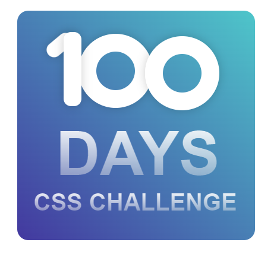

# 100 Challenges CSS

👋🏾 Eae pessoal suave?  esse é o meu repositório para colocar os desafios do site [https://100dayscss.com](https://100dayscss.com/days/1/) 

**nenhum projeto aqui é muito elaborado ou com muitas questões responsivas (dependendo do projeto) é mais para eu treinar meu css e aprender coisas novas, por isso desconsiderem essa parte responsiva 🙂 eu me preocupo com isso em projetos pessoais.

### #1 Gradiente CSS:

“100 Days CSS: Um começo fácil para o desafio com um número de compilação personalizado com gradiente”

no primeiro quis trazer as cores de uma das minhas paixões, a estação primeira de mangueira (escola de samba) para minha versão do desafio

na segunda página tentei fazer a  replica conforme o desafio

